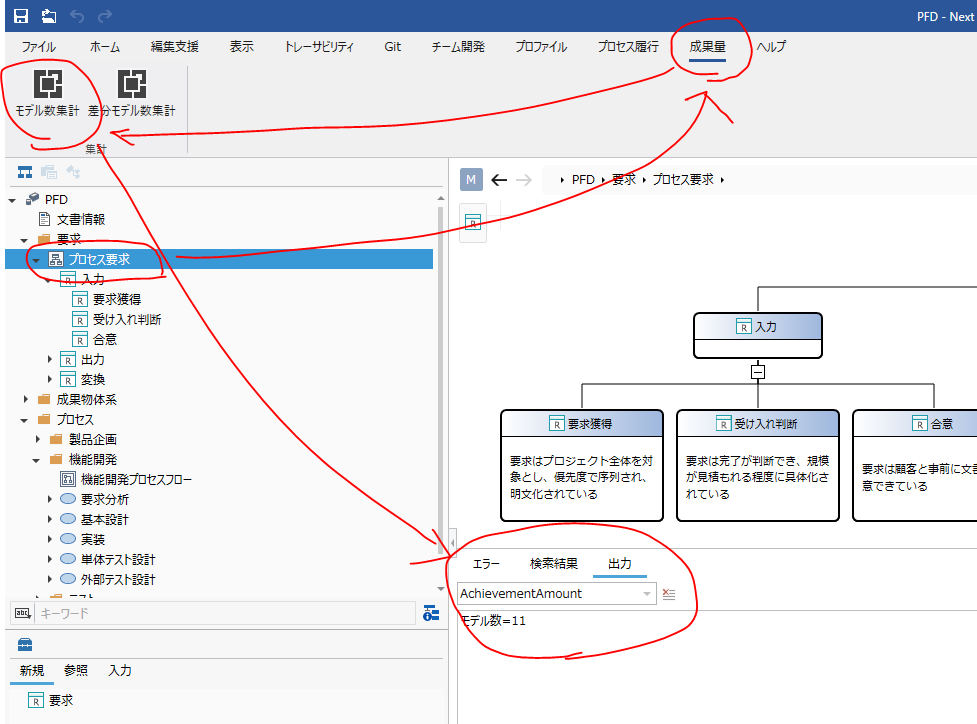
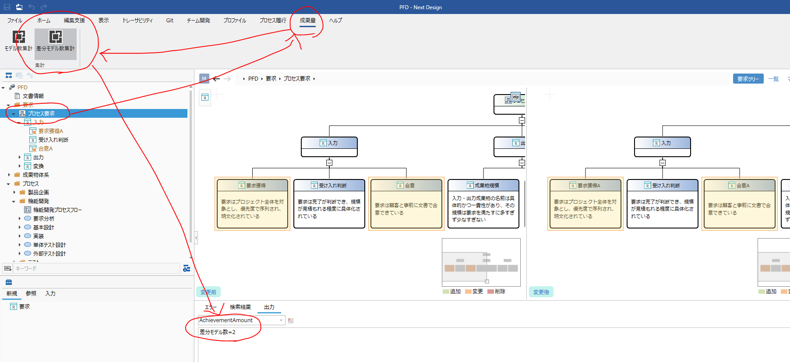

# AchievementAmount

## はじめに
Next Designのモデルエクスプローラーで選択したモデル以下に存在するモデル数を計測するエクステンションです。プロジェクト差分を取った状態で、差分のあるモデル数を計測することもできます。

## インストール方法
NugetパッケージをGithub上に公開しています。ローカルにクローンし、パッケージを格納しているフォルダをNext Designの拡張機能に登録してインストールしてください。

パッケージの格納場所は以下です。

https://github.com/dc-o-kawamura/AchievementAmount/tree/main/src/ndpackages

## 使い方

### モデル数の計測
モデルエクスプローラー上で計測したいモデルを選択し、リボンから[成果量]-[集計]-[モデル数集計]を実行してください。選択したモデル以下に存在するモデル数が集計され、出力ウインドウに結果が出力されます。

### 差分のあるモデル数の計測
プロジェクト差分を取った状態で、モデルエクスプローラー上で計測したいモデルを選択し、リボンから[成果量]-[集計]-[差分モデル数集計]を実行してください。選択したモデル以下に存在する差分のあるモデル数が集計され、出力ウインドウに結果が出力されます。

■
